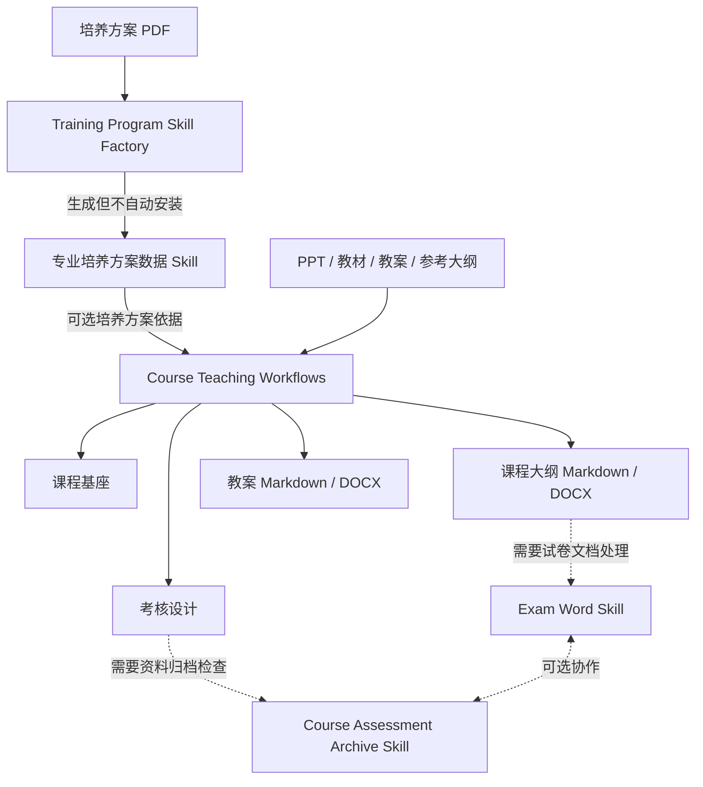

# Teaching Works Lab

面向高校课程建设与教学运行的可复用 Codex Skills 与 Plugins。

这里的仓库不是一条必须从头跑到尾的流水线。它们按任务独立安装、按证据关系组合：培养方案提供课程约束，课程工作流生成课程基座、考核设计和课程大纲，试卷处理与资料归档在需要时作为并行工具使用。

## 从这里开始

| 你的任务 | 使用仓库 | 典型输入 | 主要产出 |
| --- | --- | --- | --- |
| 从培养方案建立一个专业的数据 Skill | [training-program-skill-factory](https://github.com/Teaching-Works-Lab/training-program-skill-factory) | 培养方案 PDF、复核决定 | 可查询、可审核的专业 Skill |
| 查询智能制造工程 2025 版课程依据 | [intelligent-manufacturing-syllabus](https://github.com/Teaching-Works-Lab/intelligent-manufacturing-syllabus) | 课程名称或代码 | 课程字段、指标点关系、派生追踪 |
| 建立课程基座、设计考核或编制课程大纲 | [course-teaching-workflows](https://github.com/Teaching-Works-Lab/course-teaching-workflows) | PPT、教材、参考大纲、培养方案依据 | `course-foundation.md`、`assessment-plan.md`、大纲 DOCX |
| 编制教案（Markdown 可编辑 + Word 定稿） | [lesson-plan-compiler](https://github.com/Teaching-Works-Lab/lesson-plan-compiler) | PPT、教材、课程大纲、培养方案依据 | `教案-working.md`、`教案.docx` |
| 对比、修正或套用试卷 Word 模板 | [exam-word-skill](https://github.com/Teaching-Works-Lab/exam-word-skill) | DOCX、PDF、标准模板 | 差异报告、规范化试卷 DOCX |
| 整理和检查课程考核归档材料 | [course-assessment-archive-skill](https://github.com/Teaching-Works-Lab/course-assessment-archive-skill) | 制度要求、已有材料、角色范围 | 目录树、文件映射、缺项与责任清单 |

## 它们怎样协作



关系只有三类：

- **捆绑安装**：`course-teaching-workflows` 一次安装提供课程基座、考核设计和课程大纲编制三个 Skill。
- **可选协作**：试卷 Word、考核归档和专业数据 Skill 独立安装；任务需要时再组合。
- **生成产物**：培养方案工厂生成新的专业 Skill，但不会静默安装它。

## 安装与触发不是一回事

先添加本组织的 Marketplace：

```text
codex plugin marketplace add Teaching-Works-Lab/.github
```

然后只安装当前任务需要的 Plugin，例如：

```text
codex plugin add course-teaching-workflows@teaching-works-lab
codex plugin add intelligent-manufacturing-syllabus@teaching-works-lab
```

添加 Marketplace 只是获得可安装目录，不会自动安装全部 Plugin。安装一个 Plugin 也不会自动安装它的可选协作项或生成产物。

安装后可以让 Codex 根据请求与 Skill 描述自动选择，也可以显式调用：

```text
$training-program-skill-factory
$intelligent-manufacturing-syllabus
$course-foundation-builder
$course-assessment-planner
$course-syllabus-compiler
$lesson-plan-compiler
$exam-word
$course-assessment-archive
```

当任务重要、名称相近或希望固定工作方式时，优先显式调用。

## 给 AI 和维护者

- [`catalog.yaml`](https://github.com/Teaching-Works-Lab/.github/blob/main/catalog.yaml) 是仓库角色、输入输出、触发名称和关系的机器可读清单。
- [`.agents/plugins/marketplace.json`](https://github.com/Teaching-Works-Lab/.github/blob/main/.agents/plugins/marketplace.json) 是可选择安装的 Plugin 目录。
- GitHub Project 只用于路线图和 Issue 进度；它不表示运行依赖，也不负责安装。
- 每个仓库自己的 `README.md` 和 `SKILL.md` 仍是该工具的规范说明。

所有仓库默认保持公开、可审查，并区分来源事实、派生关系、待编制内容和生成结果。
